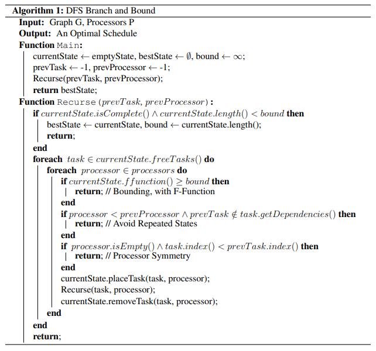

# Architecture & Class Structure

The algorithm of choice for this program is DFS Branch & Bound. This involves a DFS search that also uses a pruning/bounding method to avoid searching through sub-trees unnecesarily.

## Pruning With F-Function

The F-Function uses 2 heuristics to decide whether or not to prune a branch.

Firstly, a load-balanced time is found for the current schedule. This is calculated by taking the sum of end times for each processor, plus the sum of the weights of unassigned tasks, and dividing this total by the number of processors.

`loadBalancedTime = (sumOfProcessorEndTimes + sumOfUnassignedTaskWeights) / numProcessors`

The load-balanced time was compared to the current end time for the partial schedule. The maximum out of the two was the output of the F-Function for that schedule.

## Pseudocode

